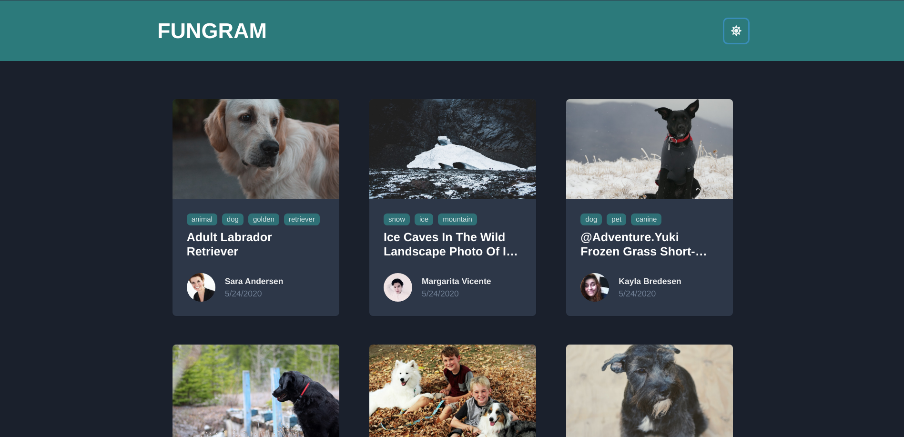

# Fungram 
This project is made uses Google Sheets api made with [NoCodeAPI](https://nocodeapi.com/) for fetching the data.


## Running the project

Create .env file and add following variable
```
REACT_APP_API=Your_Nocodeapi_Endpoint
```

Then you can run:

`yarn start` - Runs the app in the development mode.<br />
Open [http://localhost:3000](http://localhost:3000) to view it in the browser.
